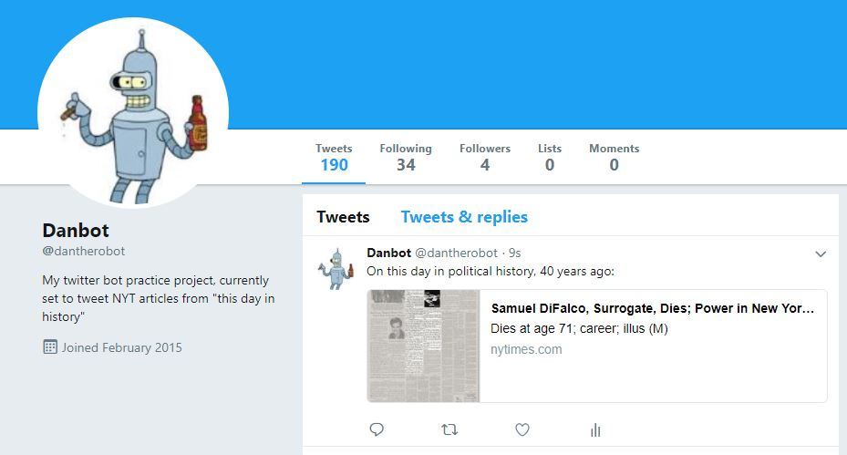

<h1>Danbot: A basic Twitterbot</h1>
<h2>In this latest commit, danbot is now posting NY Times articles 'on this day in history'; topic is currently set to politics, but this can be changed in the text_generators.py get_nyt_tweet() function:
	 
</h2>

	

 
<h3>
	Visit danbot <a href='https://twitter.com/dantherobot' target='_blank'>here,</a> he is currently set to tweet once a day from my AWS Lightsail Ubuntu instance using <a href='https://www.vultr.com/docs/using-screen-on-ubuntu-14-04'>'Screen!'</a>
</h3>
<ul>
	<li>
		Download the project folder to your local machine
	</li>
	<li>
		Create a file called credentials.py in the project folder. Include dictionaries for your Twitter account's keys and secrets in the following format:  
		<code>
			keys = {
				'CONSUMER_KEY' : 'consumer key goes here',
				'ACCESS_KEY' : 'access key goes here'
			}
		</code>
		 
		<code>
			secrets = {
				'CONSUMER_SECRET' : 'consumer secret goes here',
				'ACCESS_SECRET' : 'access secret goes here'
			}
		</code>
		 
		If you are using the New York Times text generator function, you will need to get an API key and include an nytkey variable in your credentials file in the format:
		<code>
			nytkey = 'ny times api key goes here'
		</code>
	</li>
	<li>
		Set the post interval variable ('INTERVAL') in bot.py
	</li>
	<li>
		Run python bot.py from the command line
	</li>
</ul>

<ul>
	TODO
	<li>Add more interesting text generators!</li>
</ul>
